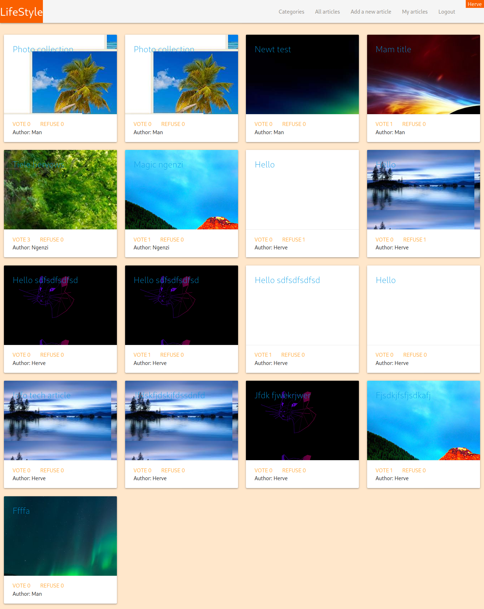

# LifeStyle

> This is a blog app project, user can write a blog and select among all categories
that the system provide, it is from the [Microverse](https://microverse.org) Ruby on Rails main curriculum





Additional description about the project and its features.

## Built With

- #### Backend
    - Ruby on Rails
    - Ruby gems
- #### Frontend
    - HTML, CSS
    - materializecss
    
## Live Demo

[Live Demo Link](https://henzblog.herokuapp.com/)


## Getting Started

### Prerequisites
   - [Ruby](https://www.ruby-lang.org/en/)
   - [Rails](https://rubyonrails.org/)
   - [Postgresql](https://www.postgresql.org/)
   - Code editor like [Visual studio code](https://code.visualstudio.com/), [Sublime-text](https://www.sublimetext.com/3) or [atom](https://atom.io/)
### Setup
* Start by cloning the project by copy/paste this ```git clone https://github.com/muhenge/lifestyle-capstone-app.git``` in the terminal
### Install
  - In the terminal to ```bundle install``` if you have [Ruby](https://www.ruby-lang.org/en/) and [Rails](https://rubyonrails.org/) to install all ruby gems used
  - Run ```rails db:create``` and ```rails db:migrate``` for the Database migration

## Authors

👤 **Author1**

- Github: [@muhenge](https://github.com/muhenge)

## 🤝 Contributing

Contributions, issues and feature requests are welcome!

Feel free to check the [issues page](https://github.com/muhenge/lifestyle-capstone-app/issues).

## Show your support

Give a ⭐️ if you like this project!


