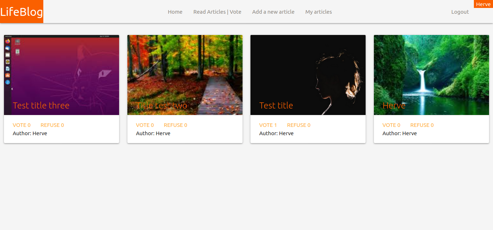
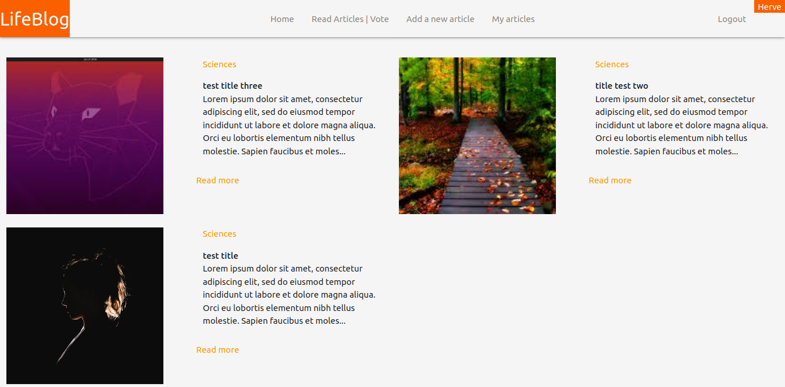
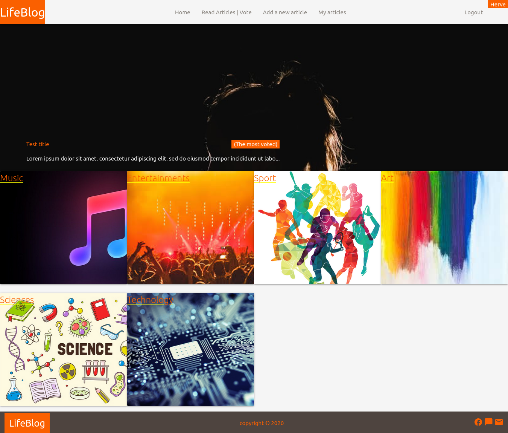
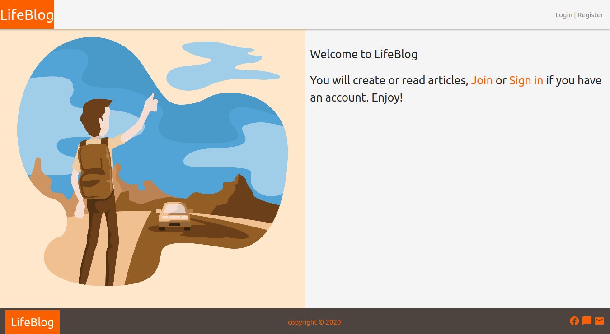

  <h1 align="center">Ruby on Rails: Blog app</h1>

  <p align="center">
 This is a blog app project, user can write a blog and select among all categories
that the system provide, it is from the <a href="https://www.microverse.org">Microverse</a> Ruby on Rails main curriculum <br />
</p>

# LifeBlog


article page to vote

article based on categories

homepage 

Additional description about the project and its features.

## Built With

- #### Backend
    - Ruby on Rails
    - Ruby gems
- #### Frontend
    - HTML, CSS
    - materializecss
    
## Live Demo

[Live Demo Link](https://herveblogapp.herokuapp.com/)


## Getting Started

### Prerequisites
   - [Ruby](https://www.ruby-lang.org/en/)
   - [Rails](https://rubyonrails.org/)
   - [Postgresql](https://www.postgresql.org/)
   - Code editor like [Visual studio code](https://code.visualstudio.com/), [Sublime-text](https://www.sublimetext.com/3) or [atom](https://atom.io/)
### Setup
* Start by cloning the project by copy/paste this ```git clone https://github.com/muhenge/lifestyle-capstone-app.git``` in the terminal
### Install
  - In the terminal to ```bundle install``` if you have [Ruby](https://www.ruby-lang.org/en/) and [Rails](https://rubyonrails.org/) to install all ruby gems used
  - Run ```rails db:create```  ```rails db:migrate``` ```rails db:seed``` for the Database migration
### Usage
  - After migration run ```rails server``` and open `http://localhost:3000/` in your browser
  - You will see the welcome page and start by creating the user
  
  ## Automated Test
Run ```bundle exec rspec```

## Authors

👤 **Author1**

- Github: [@muhenge](https://github.com/muhenge)
- LinkedIn: [Mugunga Herve](https://www.linkedin.com/in/mugunga-herve-a62a0ab9/)
- E-mail: mugunga5@gmail.com

## 🤝 Contributing

Contributions, issues and feature requests are welcome!

Feel free to check the [issues page](https://github.com/muhenge/lifestyle-capstone-app/issues).

## Show your support

Give a ⭐️ if you like this project!

<!-- ACKNOWLEDGEMENTS -->
## Acknowledgements
* [Microverse](https://www.microverse.org/)
* [Ruby Documentation](https://www.ruby-lang.org/en/documentation/)
* [Ruby on Rails](https://rubyonrails.org/)
* [materializecss](materializecss.com/)
* [Behance](https://www.behance.net/)
* [Heroku](https://www.heroku.com/)

## Credits
* Nelson Sakwa - [LiFEstIye](https://www.behance.net/gallery/14554909/liFEsTlye-Mobile-version)
